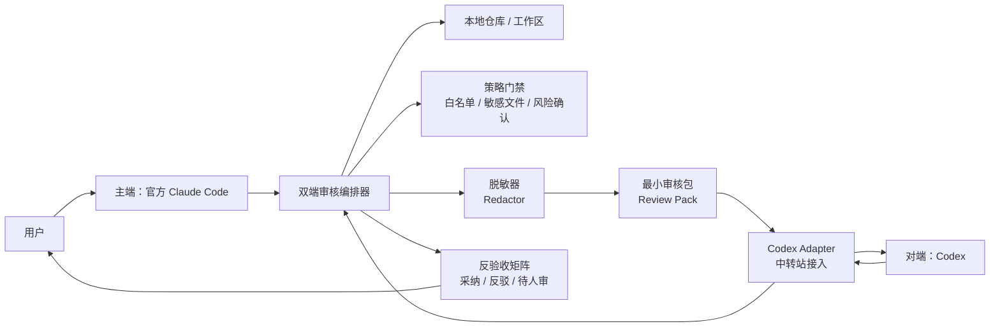
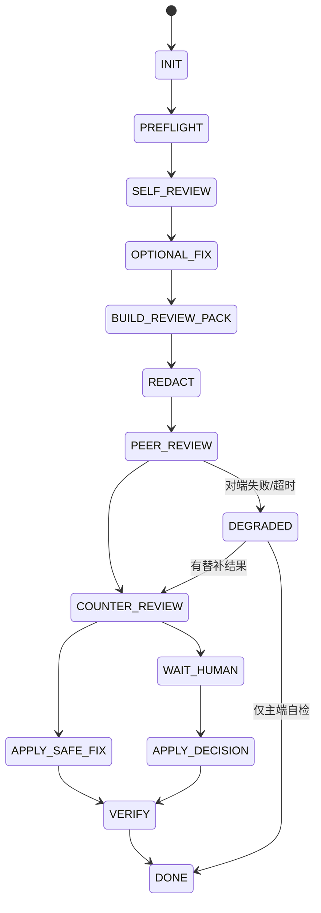

# 双端审核实现指南（脱敏版）

> 适用对象：已经有 **官方 Claude Code（下文简称 CC）**，并且有一个可调用 **Codex 的中转/代理接入** 的本地 AI 助手或自动化系统。  
> 目标：让一个 AI 主端完成任务后，自动把“必要且已脱敏”的上下文交给另一个模型/工具做第二视角审核，再由主端反验收、落地小修或交给人拍板。  
> 脱敏说明：本文所有路径、账号、域名、Key、Token、组织名、真实仓库名、模型名、内部端口均使用占位符。实际落地时请替换为你自己的安全配置，但不要把真实密钥写入 Prompt、文档、日志或 Git 仓库。

---

## 0. 一句话结论

“双端审核”不是让两个 AI 随便互聊，而是一个**受控的审查状态机**：

```text
主端执行/自检
  → 构造最小审核包
  → 脱敏
  → 调用对端独立审核
  → 主端反验收对端意见
  → 小范围安全修复或交给人拍板
  → 验证与归档
```

如果你已有“官方 CC + 可调用 Codex 的中转/代理接入”，推荐的实现形态是：

- **主控编排层（orchestrator）放在 CC 侧**：因为 CC 原生适合读仓库、跑命令、改文件、调 MCP 工具。
- **Codex 作为对端 reviewer（审查者）**：通过本地 MCP Server、CLI wrapper 或 HTTP adapter 调用中转站的 Codex。
- **所有跨端输入都必须先经过 redaction（脱敏）与 policy gate（策略门禁）**。
- **对端只给意见，不直接改代码**；最终是否修改，由主端反验收后决定。

---

## 1. 核心术语

| 术语 | 含义 |
|---|---|
| 主端 | 当前负责执行任务、改文件、跑验证的 AI。若用户在 CC 里工作，主端就是 CC。 |
| 对端 | 另一个模型/工具，只负责第二视角审核。例如主端是 CC，对端就是 Codex。 |
| 双端审核 | 主端自检 + 对端独立审核 + 主端反验收 + 人类最终决策的闭环。 |
| 知情验收 | 对端能看到任务背景、改动摘要、主端自检结论和已修复项。默认日常模式。 |
| 盲审 / 双盲 | 对端只能看到任务背景和改动事实，不看主端自检结论，降低 anchoring（锚定偏差）。 |
| 审核包 Review Pack | 发送给对端的最小上下文集合：任务、范围、diff、关键文件片段、验证结果、约束。 |
| 脱敏 Redaction | 在发送对端前遮蔽 Key、Token、邮箱、手机号、内部域名/IP、真实路径、客户名等敏感信息。 |
| 反验收 Counter-review | 主端逐条验证对端意见是否有证据，决定采纳、反驳、降级或交给人审。 |
| 门禁 Policy Gate | 白名单、敏感文件、风险确认、外发边界、提交前检查等强规则。 |

---

## 2. 为什么要这样设计

### 2.1 目的

双端审核解决的是单个 AI 容易出现的几个问题：

1. **自洽但错误**：主端容易相信自己的改动，忽略边界情况。
2. **上下文盲区**：另一个模型可能从不同角度发现遗漏。
3. **发布风险**：上线前需要第二视角，尤其是安全、配置、支付、数据、接口契约等场景。
4. **责任可追溯**：结构化记录“谁提出、主端为何采纳/反驳、最终谁拍板”。

### 2.2 原理

双端审核的有效性来自四个机制：

1. **模型差异性**：Claude 与 Codex 的训练分布、推理风格、工具链不同，能暴露不同类型的问题。
2. **角色隔离**：主端负责执行，对端负责挑错，避免“写的人自己验收自己”。
3. **信息控制**：盲审时不告诉对端主端判断，降低对端被主端结论带偏的概率。
4. **结构化裁决**：对端不是最终裁判；主端必须用实际代码、diff、日志、测试结果逐条反验收。

### 2.3 不是做什么

双端审核不是：

- 不是让两个 AI 无限辩论。
- 不是让对端直接修改生产代码。
- 不是把整个仓库、所有密钥、所有日志原样发出去。
- 不是对端说什么就照单全收。
- 不是为了形式而每个小问题都喊另一个模型。

---

## 3. 推荐总体架构

### 3.1 高层架构图



### 3.2 组件职责

| 组件 | 职责 | 不应该做什么 |
|---|---|---|
| CC 主端 | 理解用户需求、读写文件、跑测试、调用工具、最终综合判断 | 不应把密钥原样发给对端 |
| Orchestrator | 控制流程状态、构造审核包、调用对端、汇总结果 | 不应让两个模型无限循环 |
| Policy Gate | 判断仓库是否允许、文件是否敏感、是否触发高风险确认 | 不应只靠 Prompt 提醒，关键点要硬拦截 |
| Redactor | 对文本、路径、diff、日志做脱敏 | 不应破坏代码语义到无法审核 |
| Codex Adapter | 把标准 ReviewRequest 转成 Codex 调用，把返回转成 ReviewResult | 不应暴露真实 Key/Token 到模型上下文 |
| Review Store | 保存脱敏后的请求、对端结果、主端处置、验证结论 | 不应保存明文密钥或完整敏感日志 |

---

## 4. 两种落地拓扑

## 4.1 拓扑 A：CC 主控 + Codex MCP 工具（推荐）

适合用户主要在 Claude Code 中工作。

```text
Claude Code
  └─ MCP Server：dual-review-bridge
       ├─ 工具：submit_review
       ├─ 工具：get_review_result
       ├─ 工具：cancel_review
       └─ Codex Adapter：调用中转站 Codex
```

优点：

- CC 可以自然地读仓库、跑命令、改文件。
- Codex 审核能力以 MCP 工具形式暴露给 CC，调用边界清楚。
- 容易加入白名单、脱敏、日志、超时、重试。

推荐实现：

1. 写一个本地 MCP Server。
2. MCP Server 暴露 `submit_review / get_review_result / cancel_review / health`。
3. CC 在需要双端审核时调用 `submit_review`。
4. MCP Server 内部调用中转站 Codex，不把中转站密钥暴露给 CC Prompt。

## 4.2 拓扑 B：独立 Orchestrator 同时调 CC 与 Codex

适合已经有独立 AI 平台、想把 CC 和 Codex 都作为后端工具的场景。

```text
自研 Agent / Orchestrator
  ├─ Claude Adapter：调用官方 CC 或 Claude 能力
  ├─ Codex Adapter：调用中转站 Codex
  ├─ Repository Adapter：读写仓库 / 跑测试
  ├─ Redactor
  └─ Review Store
```

优点：

- 更平台化，可接入 Web UI、队列、权限系统。
- 可做更完整的任务状态、审计、监控。

缺点：

- 成本更高。
- 如果官方 CC 没有稳定机器接口，可能需要通过 CLI/MCP 方式间接编排。
- 更容易误把密钥、路径、日志记录到平台侧，需要更强治理。

## 4.3 选择建议

| 场景 | 推荐 |
|---|---|
| 个人或小团队，主要在 CC 里写代码 | 拓扑 A |
| 已有自研 Agent 平台，有统一任务队列和审计 | 拓扑 B |
| 只想先验证价值 | 先做拓扑 A 的最小版本 |
| 涉及生产发布、支付、客户数据 | 必须加 Policy Gate + Redactor + 人工确认 |

---

## 5. 标准流程状态机

### 5.1 状态图



### 5.2 每个状态做什么

| 状态 | 输入 | 动作 | 输出 |
|---|---|---|---|
| INIT | 用户任务 | 判断是否需要双端审核 | 审核模式与范围 |
| PREFLIGHT | 仓库状态、任务目标 | 白名单、脏工作区、敏感文件、高风险动作检查 | 可执行/需确认/拒绝 |
| SELF_REVIEW | 当前改动或待审对象 | 主端先自检，列 checklist | 主端自检报告 |
| OPTIONAL_FIX | 自检报告 | 只修自检命中的小问题 | 修复摘要 |
| BUILD_REVIEW_PACK | diff、文件片段、测试结果 | 构造最小审核包 | Review Pack |
| REDACT | Review Pack | 脱敏与体积裁剪 | Sanitized Review Pack |
| PEER_REVIEW | 脱敏审核包 | 调用 Codex 对端 | 对端 Review Result |
| COUNTER_REVIEW | 对端意见 | 主端逐条验证证据 | 处置矩阵 |
| APPLY_SAFE_FIX | 可自动落地的小修 | 小范围修改 | 二次 diff |
| WAIT_HUMAN | 有争议或高风险项 | 交给用户拍板 | 用户决策 |
| VERIFY | 最终改动 | build/test/lint/手工检查 | 验证报告 |
| DONE | 所有记录 | 输出总结、风险、后续 | 完整交付说明 |
| DEGRADED | 对端失败 | 走重试/替补/仅主端 | 降级说明 |

---

## 6. 何时触发双端审核

### 6.1 建议触发

| 场景 | 是否建议 | 模式 |
|---|---:|---|
| 发布前总闸 | 强烈建议 | 盲审 |
| 安全、鉴权、支付、隐私、数据迁移 | 强烈建议 | 盲审或知情验收 + 人审 |
| 跨多文件架构改动 | 建议 | 知情验收 |
| 难复现 Bug 根因修复 | 建议 | 知情验收 |
| 文档定稿、对外说明 | 建议 | 知情验收 |
| 只改注释/拼写/单行小修 | 通常不需要 | 可跳过 |
| 用户明确说“不用喊对端” | 不触发 | 单端 |

### 6.2 模式选择

| 模式 | 给对端什么 | 适合场景 |
|---|---|---|
| 知情验收 | 任务背景、改动摘要、主端自检结论、已修复项 | 日常代码改动、文档审核、小范围 Bug 修复 |
| 盲审 | 任务背景、改动事实、diff、验证结果；不提供主端自检结论 | 发布、安全、架构、根因敏感场景 |

选择规则：

1. 用户明确指定，按用户指定。
2. 发布前默认盲审。
3. 用户说“独立看 / 盲审 / 双盲 / 不要告诉对方我的判断”，走盲审。
4. 其他默认知情验收。

---

## 7. 审核包 Review Pack 设计

### 7.1 最小审核包结构

建议所有对端调用都统一成下面的结构，便于脱敏、测试、审计和扩展。

```jsonc
{
  "request_id": "review_<timestamp>_<random>",
  "mode": "informed | blind",
  "scenario": "code_change | doc_review | bugfix | release_gate | api_contract",
  "main_side": "claude_code",
  "peer_side": "codex",
  "repo": {
    "repo_alias": "repo_A",
    "branch_alias": "branch_X",
    "base_ref_alias": "base_Y",
    "worktree_state": "clean | dirty_known | isolated"
  },
  "task": {
    "goal": "脱敏后的任务目标",
    "non_goals": ["明确不做什么"],
    "constraints": ["不得修改敏感文件", "不得改接口协议，除非用户确认"]
  },
  "changes": [
    {
      "path_alias": "src/module/FileA.ts",
      "change_summary": "修复空值分支",
      "diff_excerpt": "脱敏后的 diff 片段"
    }
  ],
  "context": [
    {
      "path_alias": "docs/architecture.md",
      "content_excerpt": "必要上下文片段，控制长度"
    }
  ],
  "verification": [
    {
      "command_alias": "unit_test",
      "status": "passed | failed | not_run",
      "summary": "脱敏后的输出摘要"
    }
  ],
  "main_self_review": {
    "include_only_when_informed": true,
    "summary": "知情验收才提供；盲审删除"
  },
  "output_schema": "findings[] + summary + risk_level + blocking_items"
}
```

### 7.2 审核包应该包含什么

必须包含：

- 用户目标，脱敏后保留真实技术意图。
- 改动文件列表。
- 关键 diff，而不是整仓库。
- 相关上下文片段，例如接口定义、调用点、测试片段。
- 已跑验证命令的摘要。
- 明确约束：不要改敏感文件、不要扩大范围、不要泄露信息。

可选包含：

- 架构约束。
- 历史 Bug 背景。
- release checklist（发布检查清单）。
- 用户关心的风险点。

不要包含：

- API Key、Token、Cookie、证书、私钥。
- `.env`、`local.properties`、keystore、生产配置文件原文。
- 内部真实域名、公网 IP、客户名称、用户数据、手机号、邮箱等原始值。
- 与本次审核无关的大段日志。
- 未经确认的生产操作命令。

---

## 8. 脱敏设计

### 8.1 脱敏原则

1. **先脱敏再外发**：任何发送给对端模型的内容，都先经过 Redactor。
2. **保持可审核性**：遮住敏感值，但保留类型和关系。例如同一个 token 多次出现，应映射成同一个占位符。
3. **默认不读敏感文件**：敏感文件最好连审核包都不进入，而不是读出来再替换。
4. **日志也要脱敏**：不仅 Prompt，工具日志、错误堆栈、Review Store 都要脱敏。
5. **路径要别名化**：本机用户名、公司目录、客户名都不应出现在共享文档或对端输入里。

### 8.2 建议遮蔽项

| 类型 | 示例占位符 |
|---|---|
| API Key / Token / Secret | `<REDACTED_SECRET_1>` |
| 密码 / Cookie / Session | `<REDACTED_CREDENTIAL_1>` |
| 邮箱 | `<EMAIL_1@example.invalid>` |
| 手机号 | `<PHONE_1>` |
| 身份证 / 护照 | `<ID_NUMBER_1>` |
| 内部域名 | `<INTERNAL_DOMAIN_1>` |
| 内网 IP | `<PRIVATE_IP_1>` |
| 公网 IP | `<PUBLIC_IP_1>` |
| 本机用户名路径 | `/Users/<USER>/...` |
| 客户 / 公司名 | `<ORG_1>` |
| 订单号 / 支付流水 | `<PAYMENT_REF_1>` |

### 8.3 敏感文件黑名单

建议默认禁止读取或发送这些文件内容：

```text
.env
.env.*
*.pem
*.key
*.p12
*.p8
*.keystore
*.jks
credentials.json
service-account*.json
google-services.json
local.properties
*.mobileprovision
*.cer
*.crt
*.sqlite
*.db
```

注意：黑名单不是唯一防线，还要有白名单上下文策略。即“默认不发文件，只有明确需要的文件才进入审核包”。

### 8.4 脱敏伪代码

```ts
type RedactionMap = Map<string, string>;

function redactText(input: string, map: RedactionMap): string {
  let text = input;

  text = replaceStable(text, /sk-[A-Za-z0-9_-]{20,}/g, "<REDACTED_SECRET>", map);
  text = replaceStable(text, /(?i)(api[_-]?key|token|secret|password)\s*[:=]\s*[^\s'\"]+/g, "<REDACTED_CREDENTIAL>", map);
  text = replaceStable(text, /[A-Z0-9._%+-]+@[A-Z0-9.-]+\.[A-Z]{2,}/gi, "<EMAIL>", map);
  text = replaceStable(text, /\b1[3-9]\d{9}\b/g, "<PHONE>", map);
  text = replaceStable(text, /\b(?:10|172\.(?:1[6-9]|2\d|3[0-1])|192\.168)\.\d{1,3}\.\d{1,3}\b/g, "<PRIVATE_IP>", map);
  text = replaceStable(text, /\/Users\/[^\/\s]+/g, "/Users/<USER>", map);

  return text;
}

function shouldBlockFile(path: string): boolean {
  return matchesAny(path, [
    ".env", ".env.*", "*.pem", "*.key", "*.keystore", "*.jks",
    "credentials.json", "local.properties", "google-services.json"
  ]);
}
```

### 8.5 脱敏测试用例

必须至少覆盖：

- 同一个 token 出现 3 次，替换成同一个占位符。
- `.env` 文件内容不会进入审核包。
- diff 中新增的密钥会被拦截并报警。
- 本机路径会被替换成 `/Users/<USER>/...`。
- 内部域名和 IP 会被替换。
- 脱敏后代码片段仍能看懂变量关系。

---

## 9. 对端输出 Schema

对端必须输出结构化结果，建议 JSON 或严格 Markdown 表格。JSON 最适合程序解析。

```jsonc
{
  "summary": "整体审核结论",
  "risk_level": "low | medium | high | critical",
  "blocking_items": ["必须先处理，否则不建议合并/发布"],
  "findings": [
    {
      "id": "F001",
      "severity": "must_fix | should_fix | optional | risk_note",
      "title": "问题标题",
      "evidence": "基于 diff 或上下文的证据；不要凭空猜",
      "file": "src/module/FileA.ts",
      "line_hint": "可选行号或函数名",
      "recommendation": "建议怎么改",
      "confidence": "high | medium | low"
    }
  ],
  "missed_tests": ["建议补充的测试"],
  "questions_for_human": ["需要人确认的问题"],
  "final_verdict": "pass | pass_with_notes | changes_requested | block"
}
```

分级建议：

| 级别 | 含义 | 默认处置 |
|---|---|---|
| must_fix | 明确 bug、安全问题、会阻断构建/发布的问题 | 主端反验收后优先修，或交人确认 |
| should_fix | 有证据的质量、边界、可维护性问题 | 小范围可修则修，否则列待办 |
| optional | 风格、重构、体验优化 | 默认不扩大范围 |
| risk_note | 风险提醒，未必要求改代码 | 记录并提示用户 |

---

## 10. Prompt 模板

### 10.1 主端自检 Prompt

```markdown
# 角色
你是当前任务的主端执行者，需要先做自检，不能调用对端，也不能假设对端结论。

# 任务
<脱敏后的用户目标>

# 改动摘要
<文件列表 + 关键改动>

# 请自检
按以下维度输出：
1. 是否满足用户目标。
2. 是否有边界条件遗漏。
3. 是否引入安全/隐私/配置风险。
4. 是否破坏接口契约或兼容性。
5. 是否需要补测试。
6. 是否有必须先修的小问题。

# 输出格式
- SelfReviewSummary
- Findings: must_fix / should_fix / optional / risk_note
- SafeFixCandidates: 可由主端直接小修的条目
```

### 10.2 知情验收 Prompt（给 Codex）

```markdown
# 任务背景
<脱敏后的任务背景，1-3 句话>

# 主端 / 对端 / 模式
主端：Claude Code
对端：Codex
模式：知情验收

# 场景类型
<code_change | doc_review | bugfix | release_gate | api_contract>

# 改动摘要
<脱敏文件列表 + 关键 diff 摘要>

# 主端自检与已修复
<主端自检结论；只有知情验收提供>

# 验证情况
<测试 / 构建 / lint 的脱敏摘要>

# 约束
- 不要要求查看敏感文件原文。
- 不要建议修改密钥、证书、生产配置。
- 不要扩大到无关重构。
- 只基于提供的证据提出问题；不确定就标 low confidence。

# 请独立验收
请输出 JSON：summary、risk_level、blocking_items、findings、missed_tests、questions_for_human、final_verdict。
findings 按 must_fix / should_fix / optional / risk_note 分级。
```

### 10.3 盲审 Prompt（给 Codex）

```markdown
# 任务背景
<脱敏后的任务背景，1-3 句话>

# 主端 / 对端 / 模式
主端：Claude Code
对端：Codex
模式：盲审

# 注意
你不会看到主端自检结论。请独立判断，不要猜测主端意图。

# 场景类型
<code_change | doc_review | bugfix | release_gate | api_contract>

# 改动事实
<脱敏文件列表 + 关键 diff + 必要上下文>

# 验证情况
<测试 / 构建 / lint 的脱敏摘要>

# 约束
- 不要要求查看敏感文件原文。
- 不要建议修改密钥、证书、生产配置。
- 不要扩大到无关重构。
- 只基于提供的证据提出问题；不确定就标 low confidence。

# 请独立验收
请输出 JSON：summary、risk_level、blocking_items、findings、missed_tests、questions_for_human、final_verdict。
发布前或高风险场景请明确列出阻断项。
```

### 10.4 主端反验收 Prompt

```markdown
# 角色
你是主端，需要审计对端审核意见。不要因为对端提出就直接采纳，也不要为了维护自己原结论而忽略证据。

# 输入
- 用户目标：<脱敏>
- 实际 diff：<脱敏>
- 主端自检：<若盲审，本地保留，不曾发给对端>
- 对端 findings：<Codex 输出>

# 请逐条判断
每条 finding 判断：
1. 证据是否存在？
2. 定级是否合理？
3. 是否本轮范围内必须处理？
4. 能否小范围安全落地？
5. 是否需要用户拍板？

# 输出表格
| 级别 | 条目 | 对端观点 | 主端反验收 | 主端处置 |
|---|---|---|---|---|
| must_fix/should_fix/optional/risk_note | ... | ... | 成立/部分成立/不成立 + 理由 | 已落地/待人审/反驳保留/仅备案 |
```

---

## 11. 反验收与自动小修规则

### 11.1 主端必须做反验收

对端结果只能作为证据来源，不能直接作为最终结论。主端要逐条验证：

- 是否能在 diff 或上下文中找到证据。
- 是否误解了业务约束。
- 是否要求了超范围重构。
- 是否会触及敏感文件或生产配置。
- 是否需要补测试而不是改业务代码。

### 11.2 可以自动落地的小修条件

同时满足以下条件，主端才可以不等用户、直接落地：

1. 对端级别是 `must_fix` 或 `should_fix`。
2. 主端反验收认为“证据成立”。
3. 改动范围小：例如不超过 3 个文件、30 行。
4. 不改变接口契约、数据库结构、鉴权逻辑、发布策略。
5. 不触碰敏感文件、密钥、证书、生产配置。
6. 有明确验证方式。

不满足则进入“待人审”。

### 11.3 处置矩阵模板

```markdown
| 级别 | 条目 | 对端观点 | 主端反验收 | 主端处置 |
|---|---|---|---|---|
| must_fix | F001 空值分支遗漏 | 某函数在空数组时可能抛错 | 成立，diff 中确实没有处理空数组 | 已小修并补测试 |
| should_fix | F002 日志过多 | 建议降低日志级别 | 部分成立，但当前日志不含敏感信息 | 待人审 |
| optional | F003 命名可优化 | 建议重命名变量 | 成立但非本轮目标 | 仅备案 |
| risk_note | F004 发布需回归测试 | 需要真机验证 | 成立，无法自动完成 | 待人审 |
```

---

## 12. 降级链路

对端不一定总是可用，必须定义降级。

```text
Codex 对端审核
  → 失败最多重试 1 次
  → 仍失败则可切换备用 reviewer（如果有）
  → 备用也失败，则明确标记：仅主端自检，未完成交叉审核
```

### 12.1 失败类型

| 失败类型 | 处理 |
|---|---|
| 超时 | 取消 session，重试 1 次，可缩小审核包 |
| 鉴权失败 | 不重试多次，提示检查中转站配置 |
| 空返回 | 重试 1 次，仍失败则降级 |
| JSON 解析失败 | 可要求对端按 schema 重输 1 次 |
| 上下文过大 | 裁剪 diff，只保留关键文件与摘要 |
| 触发敏感内容拦截 | 停止外发，要求人工确认或进一步脱敏 |

### 12.2 降级输出必须写清楚

```markdown
## 双端审核状态
- 对端：Codex
- 模式：盲审
- 状态：未完成
- 原因：对端调用超时，重试 1 次仍失败
- 当前结论：仅完成主端自检，不能视为双端审核通过
- 建议：稍后重试对端审核，或人工 review 后再发布
```

---

## 13. 并发与资源控制

### 13.1 为什么要控制并发

中转站 Codex 接入通常会有：

- 并发限制。
- 超时限制。
- 账号或额度限制。
- 流式连接稳定性问题。
- 多个任务共享同一个本地仓库的风险。

### 13.2 推荐规则

1. **同一仓库同一分支同一时间只允许一个写任务**。
2. 对端审核默认只读，不写文件。
3. 若要多个 reviewer 并行，只传脱敏审核包，不让它们改同一目录。
4. 对中转站调用设置队列和并发上限，例如 `max_concurrent_codex_reviews = 1~3`。
5. 每个 review 请求有超时，例如 5~15 分钟，按任务规模调整。
6. 调用失败不要无限重试，最多 1 次。
7. 长会话用完要显式 cancel/close，避免占资源。

### 13.3 锁设计

锁粒度建议：

```text
review_lock_key = hash(repo_alias + branch_alias + task_scope)
```

只读审核可以共享锁；写文件、commit、rebase、merge、push 必须独占锁。

---

## 14. MCP 工具接口设计

如果走“CC 主控 + MCP Server 调 Codex”，建议工具不要太多，先做 4 个。

### 14.1 `health`

用途：确认对端可用。

```jsonc
{
  "tool": "health",
  "input": {}
}
```

输出：

```jsonc
{
  "ok": true,
  "peer": "codex",
  "relay_status": "available",
  "redaction_enabled": true
}
```

### 14.2 `submit_review`

用途：提交一次对端审核。

```jsonc
{
  "repo_path": "/ABS/PATH/TO/REPO",
  "mode": "informed | blind",
  "scenario": "code_change | doc_review | bugfix | release_gate | api_contract",
  "goal": "任务目标",
  "changed_files": ["src/module/FileA.ts"],
  "diff": "可选；不传则由 server 自己采集 git diff",
  "context_files": ["README.md", "src/module/types.ts"],
  "verification": [
    { "command": "npm test", "status": "passed", "summary": "脱敏摘要" }
  ],
  "main_self_review": "知情验收才传；盲审不传",
  "timeout_ms": 600000
}
```

### 14.3 `get_review_result`

用途：取回结果。

```jsonc
{
  "review_id": "review_xxx"
}
```

输出：

```jsonc
{
  "review_id": "review_xxx",
  "status": "succeeded | failed | running | degraded",
  "result": {
    "summary": "...",
    "risk_level": "medium",
    "findings": []
  },
  "redaction_report": {
    "secrets_redacted": 3,
    "blocked_files_skipped": 1,
    "path_aliases_applied": true
  }
}
```

### 14.4 `cancel_review`

用途：取消长任务。

```jsonc
{
  "review_id": "review_xxx",
  "force": false
}
```

---

## 15. TypeScript 参考骨架

> 这只是骨架，不包含任何真实 endpoint、Key 或账号配置。

### 15.1 类型定义

```ts
export type ReviewMode = "informed" | "blind";
export type Scenario = "code_change" | "doc_review" | "bugfix" | "release_gate" | "api_contract";

export interface ReviewRequest {
  requestId: string;
  mode: ReviewMode;
  scenario: Scenario;
  goal: string;
  repoAlias: string;
  changedFiles: ChangedFile[];
  context: ContextSnippet[];
  verification: VerificationEntry[];
  mainSelfReview?: string;
  constraints: string[];
}

export interface ChangedFile {
  pathAlias: string;
  changeSummary: string;
  diffExcerpt: string;
}

export interface ContextSnippet {
  pathAlias: string;
  contentExcerpt: string;
}

export interface VerificationEntry {
  commandAlias: string;
  status: "passed" | "failed" | "not_run";
  summary: string;
}

export interface ReviewFinding {
  id: string;
  severity: "must_fix" | "should_fix" | "optional" | "risk_note";
  title: string;
  evidence: string;
  file?: string;
  lineHint?: string;
  recommendation: string;
  confidence: "high" | "medium" | "low";
}

export interface ReviewResult {
  summary: string;
  riskLevel: "low" | "medium" | "high" | "critical";
  blockingItems: string[];
  findings: ReviewFinding[];
  missedTests: string[];
  questionsForHuman: string[];
  finalVerdict: "pass" | "pass_with_notes" | "changes_requested" | "block";
}
```

### 15.2 Adapter 接口

```ts
export interface PeerReviewerAdapter {
  name: "codex" | "claude" | "other";
  health(): Promise<{ ok: boolean; reason?: string }>;
  review(request: ReviewRequest, options: { timeoutMs: number }): Promise<ReviewResult>;
  cancel?(requestId: string): Promise<void>;
}
```

### 15.3 Codex Adapter 伪代码

```ts
export class CodexRelayAdapter implements PeerReviewerAdapter {
  name = "codex" as const;

  constructor(private readonly config: {
    endpoint: string;          // 从环境变量读取，不写进 Prompt
    credentialEnvName: string; // 例如 CODEX_RELAY_API_KEY
    model: string;             // 从配置读取
  }) {}

  async health() {
    // 最小化健康检查，不输出密钥，不把错误中的敏感 header 写日志
    return { ok: true };
  }

  async review(request: ReviewRequest, options: { timeoutMs: number }): Promise<ReviewResult> {
    const prompt = buildPeerReviewPrompt(request);
    const responseText = await callRelayCodex({
      endpoint: this.config.endpoint,
      credentialEnvName: this.config.credentialEnvName, // 运行时由 adapter 读取
      model: this.config.model,
      prompt,
      timeoutMs: options.timeoutMs,
    });
    return parseReviewResult(responseText);
  }
}
```

### 15.4 编排器伪代码

```ts
export async function runDualReview(input: UserTaskInput) {
  const preflight = await policyGate.check(input);
  if (!preflight.allowed) return preflight.toUserMessage();

  const selfReview = await mainSide.selfReview(input);

  const safeFixes = selectSafeFixes(selfReview.findings);
  if (safeFixes.length > 0) {
    await mainSide.applyFixes(safeFixes);
  }

  const rawPack = await buildReviewPack({
    input,
    selfReview: input.mode === "informed" ? selfReview : undefined,
  });

  const redactedPack = redactor.redactReviewPack(rawPack);
  if (redactedPack.blocked) {
    return askHumanForDecision(redactedPack.reason);
  }

  let peerResult: ReviewResult | undefined;
  try {
    peerResult = await codexAdapter.review(redactedPack.request, { timeoutMs: input.timeoutMs });
  } catch (firstError) {
    try {
      peerResult = await codexAdapter.review(redactedPack.request, { timeoutMs: input.timeoutMs });
    } catch (secondError) {
      return degradedResult({ selfReview, reason: sanitizeError(secondError) });
    }
  }

  const counterReview = await mainSide.counterReview({
    selfReview,
    peerResult,
    actualDiff: await repo.getDiffRedacted(),
  });

  const autoFixes = selectAutoApplicableFixes(counterReview);
  if (autoFixes.length > 0) {
    await mainSide.applyFixes(autoFixes);
  }

  const verification = await runVerification(input.acceptanceChecks);

  return buildFinalReport({ selfReview, peerResult, counterReview, verification });
}
```

---

## 16. Policy Gate 设计

### 16.1 仓库白名单

只允许审核明确配置过的仓库。

```yaml
allowed_repositories:
  - /ABS/PATH/TO/REPO_A
  - /ABS/PATH/TO/REPO_B

blocked_files:
  - .env
  - .env.*
  - local.properties
  - credentials.json
  - google-services.json
  - "*.keystore"
  - "*.jks"
  - "*.pem"
  - "*.key"
```

### 16.2 强确认边界

以下情况必须停下来问人，不让 AI 自动继续：

- 要展示、复制、修改、提交任何密钥/Token/证书。
- 要改生产配置、线上域名、支付、账号池、风控相关配置。
- 要执行破坏性命令，例如强制覆盖、删除、强推、清库。
- 要把包含个人信息、客户信息、支付信息、设备唯一标识的数据发给外部模型。
- 要让对端直接写文件或执行命令。

### 16.3 Prompt 约束不是安全边界

只在 Prompt 里写“不要改敏感文件”不够。至少需要：

1. 构造审核包时不读取敏感文件。
2. 发送前做正则 + 语义脱敏。
3. 提交前检查 staged files 是否包含敏感路径。
4. 日志落盘前二次脱敏。
5. 人审前明确标出剩余风险。

---

## 17. 验证与交付

### 17.1 验证命令

按项目类型配置：

| 项目类型 | 常见验证 |
|---|---|
| Node / TS | `pnpm test`、`pnpm lint`、`pnpm build` |
| Python | `pytest`、`ruff check`、`mypy` |
| Android | `./gradlew test`、`./gradlew lint`、指定 module test |
| iOS | `xcodebuild test` 或 XcodeBuildMCP 测试 |
| 文档 | 渲染检查、链接检查、事实核对 |

### 17.2 合并/提交策略

建议：

- 双端审核默认不自动 push。
- 有改动且验证通过，才允许 commit。
- 发布前、高风险改动必须人工确认。
- 对端审核失败不代表任务失败，但必须在报告里标明“未完成交叉审核”。

### 17.3 最终报告模板

```markdown
## 双端审核结果

- 主端：Claude Code
- 对端：Codex
- 模式：知情验收 / 盲审
- 场景：代码改动 / 文档 / 发布前总闸
- 状态：完成 / 降级 / 未完成

## 做了什么
- ...

## 对端发现
| 级别 | 条目 | 证据 | 建议 |
|---|---|---|---|

## 主端反验收
| 条目 | 主端判断 | 处置 |
|---|---|---|

## 已落地
- ...

## 待人审
- ...

## 验证
- `test_command_alias`: passed / failed / not_run

## 风险
- ...

## 下一步
- ...
```

---

## 18. 最小可行版本（MVP）

如果你朋友想快速做出来，先不要做大平台，按这个 MVP 来：

### 18.1 MVP 范围

只支持：

- CC 主控。
- Codex 对端只读审核。
- 手动触发双端审核。
- 只审当前 git diff。
- 强制脱敏。
- 输出 Markdown 处置矩阵。

暂不支持：

- 自动并行多个 reviewer。
- 自动 push / 发布。
- 对端直接改代码。
- 复杂长期任务队列。

### 18.2 MVP 步骤

1. 写 `dual-review-bridge` MCP Server。
2. 加 `health` 和 `submit_review` 两个工具。
3. `submit_review` 内部执行：
   - 检查 repo 白名单。
   - 读取 `git diff --stat` 和 `git diff`。
   - 跳过 blocked files。
   - 脱敏 diff。
   - 拼盲审或知情验收 Prompt。
   - 调用中转 Codex。
   - 返回结构化审核结果。
4. CC 收到结果后，按反验收模板输出处置矩阵。
5. 人工决定是否落地。

### 18.3 MVP 文件结构

```text
dual-review-bridge/
  package.json
  src/
    index.ts                 # MCP server entry
    policy.ts                # 白名单 / blocked files
    redactor.ts              # 脱敏
    repo.ts                  # git diff / context reader
    prompt.ts                # prompt templates
    codex-adapter.ts         # 中转 Codex 调用
    review-types.ts          # schema
    result-parser.ts         # JSON/Markdown parser
  config/
    policy.example.yaml
  README.md
```

---

## 19. 完整版本路线图

| 阶段 | 目标 | 关键能力 |
|---|---|---|
| V0 | 手动双端审核 | 当前 diff、脱敏、Codex 只读审查 |
| V1 | 稳定 MCP 化 | health、submit、status、cancel、日志、超时 |
| V2 | 审计闭环 | Review Store、处置矩阵、验证报告、降级说明 |
| V3 | 发布前总闸 | release checklist、盲审默认、阻断项、人工确认 |
| V4 | 多 reviewer | Codex + 备用模型，但主端仍统一反验收 |
| V5 | 平台化 | Web UI、队列、权限、指标、团队审计 |

---

## 20. 朋友的 AI 可以直接采用的系统规则

可以把下面这段作为你朋友 AI 的规则/Skill/Agent 指令雏形。

```markdown
# 双端审核规则

当用户要求“叫另一个模型审一下 / 双端审核 / 盲审 / 发布前过一遍”，或任务涉及发布、安全、鉴权、支付、隐私、数据迁移、接口契约、大范围改动时，启动双端审核流程。

## 流程
1. 先判断模式：默认知情验收；发布前或用户要求独立看时用盲审。
2. 主端先自检，列出 findings。
3. 只修自检命中的小范围问题，不扩大范围。
4. 构造最小审核包：任务、改动摘要、必要 diff、验证摘要、约束。
5. 发送对端前必须脱敏；敏感文件不进入审核包。
6. 调用对端 reviewer；失败最多重试 1 次。
7. 对端返回后，主端逐条反验收，不照单全收。
8. 符合“小范围、安全、证据成立”的条目可自动修；其他交给人审。
9. 最终输出：对端发现、主端反验收、已落地、待人审、验证、风险。

## 禁止
- 禁止把 Key/Token/密码/证书/生产配置原文发给对端。
- 禁止让对端直接改文件或执行命令，除非用户明确授权且有隔离环境。
- 禁止无限重试或无限辩论。
- 禁止对端失败后假装完成双端审核。
- 禁止把 Prompt 约束当成唯一安全边界。
```

---

## 21. 常见反模式

| 反模式 | 问题 | 正确做法 |
|---|---|---|
| 直接把整个仓库打包给对端 | 泄密、上下文浪费、审查噪声大 | 只发最小审核包 |
| 对端说什么就改什么 | 可能误判、过度重构 | 主端必须反验收 |
| 只写“不要泄露” | Prompt 不是安全边界 | 文件拦截 + 脱敏 + 日志治理 |
| 对端失败后不说明 | 用户误以为已双端通过 | 明确降级状态 |
| 两个 AI 无限争论 | 浪费额度且不收敛 | 最多 1-2 轮，分歧交人 |
| 把真实 endpoint/key 写进文档 | 高风险泄密 | 用环境变量和占位符 |
| 审核和写入混在一起 | 难追责，容易撞车 | 对端默认只读，主端统一落地 |
| 忽略测试 | 只有文本意见，没有客观验证 | 必须跑 build/test/lint 或解释未跑原因 |

---

## 22. 上线前检查清单

### 22.1 安全

- [ ] Key/Token 只存在环境变量或安全密钥管理中。
- [ ] `.env`、证书、keystore、生产配置不会被读取进审核包。
- [ ] Prompt、日志、Review Store 都做脱敏。
- [ ] 仓库白名单生效。
- [ ] 高风险动作会停下来等用户确认。
- [ ] 对端默认只读。

### 22.2 稳定性

- [ ] 对端 health check 可用。
- [ ] 超时和取消机制可用。
- [ ] 失败最多重试 1 次。
- [ ] JSON 解析失败有兜底。
- [ ] 上下文过大时可裁剪。
- [ ] 长会话会释放资源。

### 22.3 审核质量

- [ ] 支持知情验收和盲审。
- [ ] 对端输出有 severity、evidence、recommendation。
- [ ] 主端输出反验收矩阵。
- [ ] 自动小修有范围限制。
- [ ] 分歧会交给人审。

### 22.4 工程

- [ ] 单元测试覆盖 Redactor。
- [ ] 集成测试用假 Codex Adapter 跑通。
- [ ] MCP 工具 schema 有参数说明。
- [ ] README 写清楚如何接入 CC。
- [ ] 示例配置不含真实信息。

---

## 23. 测试方案

### 23.1 单元测试

1. `redactor.test.ts`
   - Token 替换。
   - 邮箱/手机号/IP 替换。
   - 路径别名化。
   - 同值稳定映射。

2. `policy.test.ts`
   - 白名单允许/拒绝。
   - blocked files 命中。
   - 高风险场景触发确认。

3. `prompt.test.ts`
   - 盲审 Prompt 不包含主端自检。
   - 知情验收 Prompt 包含主端自检。
   - Prompt 不包含原始密钥样式。

4. `parser.test.ts`
   - 正常 JSON 解析。
   - Markdown fallback。
   - 缺字段降级处理。

### 23.2 集成测试

使用 FakeCodexAdapter：

```ts
class FakeCodexAdapter implements PeerReviewerAdapter {
  name = "codex" as const;
  async health() { return { ok: true }; }
  async review() {
    return {
      summary: "fake review",
      riskLevel: "medium",
      blockingItems: [],
      findings: [{
        id: "F001",
        severity: "should_fix",
        title: "示例问题",
        evidence: "基于 fake diff",
        recommendation: "补充空值判断",
        confidence: "high"
      }],
      missedTests: [],
      questionsForHuman: [],
      finalVerdict: "changes_requested"
    };
  }
}
```

验证：

- 能从 git diff 构造审核包。
- 能脱敏。
- 能解析对端结果。
- 能生成反验收矩阵。
- 对端失败会降级。

### 23.3 人工演练

找一个无敏感信息的 demo 仓库：

1. 故意写一个空指针 bug。
2. 主端自检先尝试发现。
3. 盲审交给 Codex。
4. 看对端是否发现。
5. 主端反验收并修复。
6. 跑测试。
7. 输出最终报告。

---

## 24. 实现优先级建议

如果时间有限，优先级如下：

1. **脱敏和敏感文件拦截**：没有这个不要上线。
2. **只读对端审核**：先不让对端改文件。
3. **盲审/知情验收模式**：先实现 Prompt 分支。
4. **结构化输出**：没有 schema，后面很难自动化。
5. **反验收矩阵**：避免对端意见直接变成改动。
6. **超时/重试/降级**：避免卡死。
7. **Review Store**：方便追溯。
8. **自动小修**：最后再做，而且必须范围很小。

---

## 25. 给朋友 AI 的落地任务拆解

可以直接把下面任务列表交给朋友的 AI 执行：

```markdown
请在当前环境实现一个“CC 主控 + Codex 对端审核”的 MVP。

要求：
1. 不写入真实 API Key；所有密钥走环境变量。
2. 不读取或发送 `.env`、证书、keystore、local.properties、credentials.json 等敏感文件。
3. 实现 Redactor，并为 token/email/phone/ip/path 写单元测试。
4. 实现 MCP 工具：health、submit_review、get_review_result、cancel_review。
5. submit_review 默认只审当前 git diff，对端只读，不改文件。
6. 支持 mode=informed/blind；blind 模式不得包含主端自检结论。
7. Codex 返回必须解析为 findings schema；解析失败时重试一次要求 JSON。
8. 输出主端反验收矩阵模板，但不要自动大范围改代码。
9. 对端失败最多重试一次；失败后明确输出“仅主端自检，未完成双端审核”。
10. README 用占位符写接入方式，不包含真实 endpoint、token、账号、内部域名。
```

---

## 26. 关键提醒

1. **双端审核的价值在“独立 + 受控 + 可追溯”，不是模型数量越多越好。**
2. **脱敏是前置步骤，不是事后补救。**
3. **对端默认只读，主端统一落地。**
4. **盲审时不要把主端自检结论塞给对端，否则就不是盲审。**
5. **对端失败要如实说明，不能假装交叉审核完成。**
6. **涉及密钥、生产、支付、账号池、发布、删除、强推等动作，必须停下来让人确认。**

---

## 27. 附录：超短版流程卡片

```text
1. 判定是否需要双端审核
2. 选模式：日常知情，发布/安全盲审
3. 主端自检
4. 小范围修自检问题
5. 构造最小审核包
6. 脱敏 + 敏感文件拦截
7. 调 Codex 对端审核
8. 主端反验收
9. 小范围安全修复 or 交人审
10. 跑验证
11. 输出最终报告与风险
```
